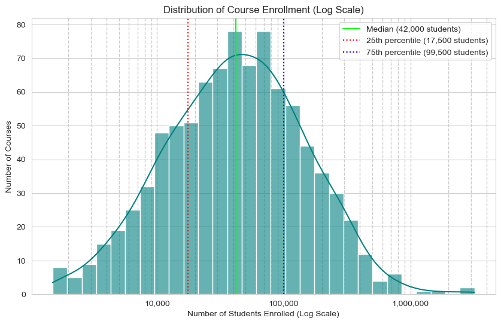
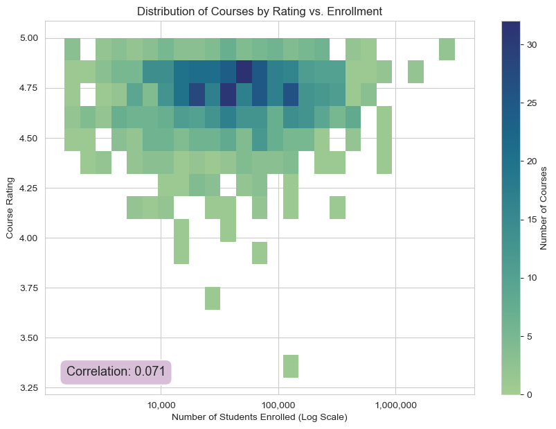
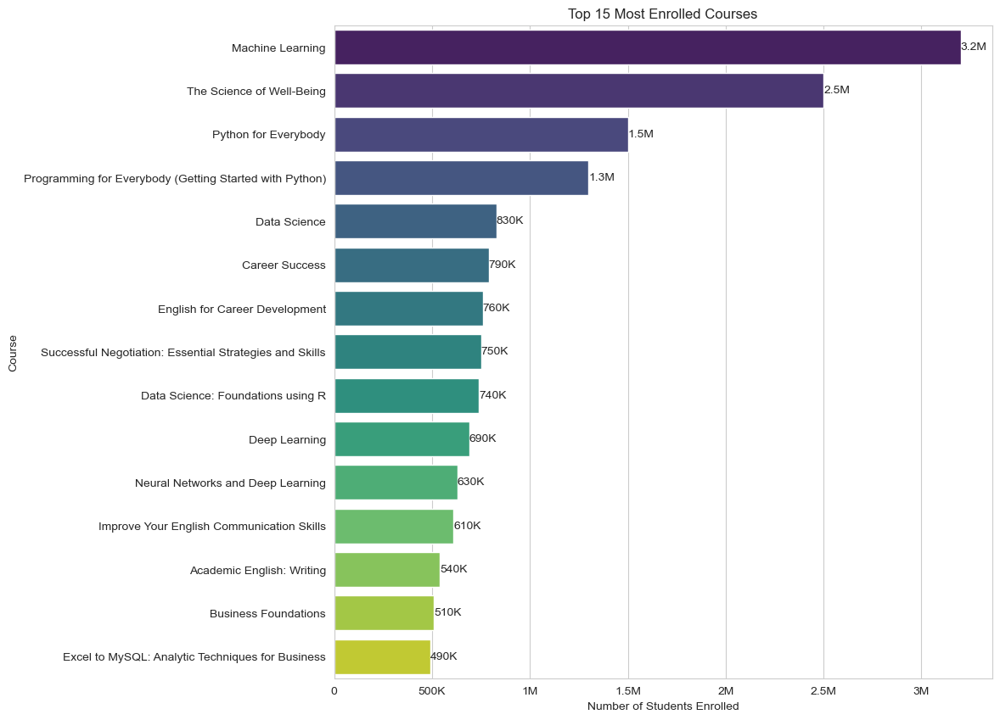

# Decoding Coursera: An EDA of Course Popularity and Quality

## ℹ️ Description

This repository contains an Exploratory Data Analysis (EDA) performed on the popular "Coursera Course Dataset" from Kaggle. The primary goal is to uncover key patterns and insights related to course offerings, student enrollment, user ratings, difficulty levels, and provider characteristics on the Coursera platform.

This analysis leverages core Python data science libraries for data manipulation and visualization, presenting findings in a structured Jupyter Notebook. It serves as a practical application of EDA techniques.

## 💾 Dataset

The analysis is based on the **Coursera Course Dataset**.

* **Source:** Available on Kaggle [🔗 Link to Dataset](https://www.kaggle.com/datasets/siddharthm1698/coursera-course-dataset)
* **Contents:** Includes details like course titles, providing organizations, difficulty ratings, student enrollment figures (initially as strings), certificate types, and course ratings.

⚠️ *Note: Please download the dataset directly from Kaggle via the link above.*

## 🎯 Project Objectives

- Load, inspect and clean the data using Pandas

- Assess the overall distribution of course quality

- Analyze the relationship between course quality and popularity

- Investigate the influence of course characteristics (such as difficulty level and certificate type) on ratings and enrollment.

- Identify and compare the top performing institutions

- Structure and communicate findings to provide data driven insights

## 🛠️ Libraries Used
* 
* 🐼 Pandas
* 🔢 NumPy
* 📊 Matplotlib
* 🎨 Seaborn
* 📓 Jupyter Notebook

## 📦 Setup and Usage

1.  **Clone the repository.**
2.  **Ensure you have Python 3.x installed.**
3.  **Install necessary libraries:**
    ```bash
    pip install pandas numpy matplotlib seaborn jupyter
    ```
4.  **Open and run the Jupyter Notebook:**
    * `coursera.ipynb` contains all the analysis.

Once the repository is cloned, the dataset is downloaded, and the dependencies are installed, you can open and run the main analysis notebook using your preferred Jupyter environment.

⚠️ *Note: The `assets/` folder is intended for project-related images. It is not required for initial setup.*

## 💡 Analysis Highlights & Key Findings

This EDA project progresses through several key stages, uncovering the following insights:

**Data Preparation:**

- Successfully cleaned the dataset, including parsing varied enrollment number formats (e.g., '1.5m', '3k') into a usable numeric format.

**Distribution Insights:**

- Ratings are generally high for courses.
- Enrollment numbers exhibit extreme right-skewness, indicating most courses have modest enrollment while a few "mega-courses" dominate. Log scales are used for visualization.
- The course catalog heavily features 'Beginner' level content.



**Rating Factors:**

- Explored how ratings correspond with course difficulty and certificate type, often revealing subtle differences between categories.

**Enrollment Dynamics:**

- Investigated how enrollment varies by difficulty and certificate type, often showing differences in median values.
- Confirmed a surprisingly **weak correlation** between course ratings and student enrollment, visualized using density heatmaps. Popularity isn't solely driven by rating.



**Organizational Landscape:** 
- Identified top organizations based on course volume, total enrollment, median enrollment per course (efficiency), and average ratings (filtered for reliability).
- Revealed distinct provider strategies: some focus on high volume/total reach, while others excel in high median enrollment per course (efficiency/consistency).

**Top Performers:** 

- Pinpointed the specific courses attracting the highest number of students, often centered around high-demand tech and personal development topics from prominent institutions.



*(Visualizations used include histograms, count plots, box/violin plots, bar charts, scatter plots, and 2D density heatmaps.)*

## 🚀 Future Work

Potential avenues for extending this analysis:

* Apply NLP techniques to course titles/descriptions for topic modeling and sentiment analysis.
* Develop predictive models to estimate enrollment success or rating potential.
* Apply ANOVA and/or t-tests to determine categorical significance. 
* Integrate or update data sources (newer Coursera dataset).

## 👤 Author

* Laisvis Remeikis
* 🔗 [LinkedIn](https://www.linkedin.com/in/laisvisr/)
